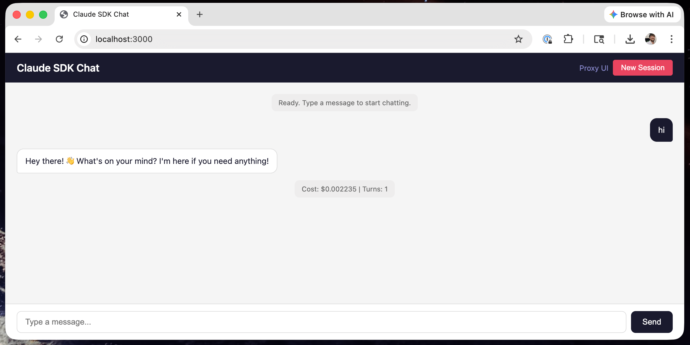
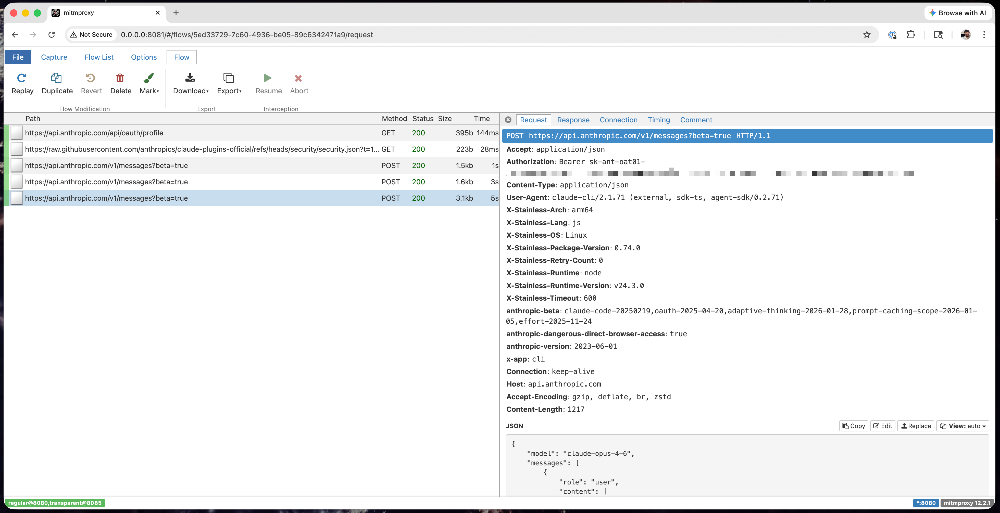

# Claude Agent SDK & Claude Code Spy

A Docker Compose setup that runs the [Claude Agent SDK](https://docs.anthropic.com/en/docs/claude-code/sdk) and [Claude Code CLI](https://docs.anthropic.com/en/docs/claude-code) behind an [mitmproxy](https://mitmproxy.org/) sidecar, capturing **all** HTTP/HTTPS traffic for inspection.

Includes a web-based chat interface for interacting with the Agent SDK, a Claude Code CLI container, and a proxy UI for viewing captured requests/responses.

## Quick Start

1. Copy `.env.example` to `.env` and set your credentials:

   ```bash
   cp .env.example .env
   ```

   Set either `ANTHROPIC_API_KEY` or place a `credentials.json` file in the project root (credentials.json takes priority).

   ```bash
   # Re-use your existing claude code credentials (optional)
   cp ~/.claude/.credentials.json credentials.json

   # Or if you're on a mac, dump the credentials from keychain
   security find-generic-password -s "Claude Code-credentials" -w > credentials.json
   ```

2. Start the Agent SDK chat UI:

   ```bash
   docker compose up -d --build
   ```

3. Or start a Claude Code CLI session (proxy starts automatically):

   ```bash
   ./claude-code.sh
   ```

   On first run, Claude will prompt you to log in. Credentials are persisted in a Docker volume so you only need to log in once. Local credentials.json is not used.

4. Open the UIs:

   - **Chat UI:** [http://localhost:3000](http://localhost:3000)
   - **Proxy UI:** [http://localhost:8081/?token=mitmpass](http://localhost:8081/?token=mitmpass)

   > If you change `MITMPROXY_WEB_PASSWORD` in your `.env`, update the `?token=` value in the Proxy UI URL to match.

<p align="center">
  
</p>

<p align="center">
  
</p>

## How It Works

```text
┌─────────────────────────────────────────────────────┐
│  Shared network namespace (network_mode: service)   │
│                                                     │
│  ┌──────────────┐         ┌──────────────────────┐  │
│  │  claude      │         │   proxy (mitmproxy)  │  │
│  │  :3000 chat  │─PROXY──▶│  :8080 explicit      │  │
│  └──────────────┘    │    │  :8085 transparent   │  │
│                      │    │  :8081 web UI        │  │
│  ┌──────────────┐    │    └──────────────────────┘  │
│  │  claude-code │    │            ▲                 │
│  │  (cli, opt.) │────┘    iptables│REDIRECT         │
│  └──────────────┘─────────────────┘                 │
│         (catches traffic ignoring proxy env vars)   │
└─────────────────────────────────────────────────────┘
```

**Two interception layers ensure nothing escapes:**

- **Explicit proxy** (port 8080) &mdash; Apps that respect `HTTPS_PROXY` connect here directly.
- **Transparent proxy** (port 8085) &mdash; iptables NAT rules redirect any remaining port 80/443 traffic (IPv4 + IPv6). Mitmproxy uses `SO_ORIGINAL_DST` to recover the real destination.

## Project Structure

```
├── app/                  # Bun chat server (mounted into claude container)
│   ├── index.ts          # HTTP server with SSE streaming + inline chat UI
│   └── package.json
├── claude/
│   ├── Dockerfile        # Bun image + iptables + CA cert tools
│   └── entrypoint.sh     # CA cert install, credentials, iptables, app launch
├── claude-api/
│   ├── api-server.ts     # API proxy with cache-control-auto & message fixes
│   ├── intercept-server.ts # Captures SDK request template on startup
│   ├── capture.ts        # Sends test query to capture SDK headers
│   └── entrypoint.sh     # CA cert install, SDK capture, server launch
├── claude-code/
│   ├── Dockerfile        # Node 22 image + Claude Code CLI
│   └── entrypoint.sh     # CA cert install, iptables, exec claude
├── proxy/
│   └── Dockerfile        # mitmproxy image
├── claude-code.sh        # Wrapper script to launch CLI session
├── docker-compose.yml
├── .env.example
└── credentials.json      # (optional) OAuth credentials for Agent SDK, gitignored
```

## Configuration

| Variable | Default | Description |
|----------|---------|-------------|
| `ANTHROPIC_API_KEY` | &mdash; | API key for the Claude SDK |
| `MITMPROXY_WEB_PASSWORD` | `mitmpass` | Password for the mitmproxy web UI (`?token=` param) |

Alternatively, place a `credentials.json` file in the project root for OAuth-based authentication (Agent SDK container only). If present, it takes priority over `ANTHROPIC_API_KEY`.

The Claude Code CLI container uses a persistent Docker volume for `/root`, so you log in once via `./claude-code.sh` and credentials survive `docker compose down`/`up`.

## Disabling SDK Telemetry

The `CLAUDE_CODE_DISABLE_NONESSENTIAL_TRAFFIC` env var is enabled by default in `docker-compose.yml` to suppress SDK telemetry (Datadog, Sentry, etc.). Comment it out if you want to capture and inspect telemetry traffic too.

## API Proxy Server

This project provides an additional Anthropic API proxy container to use for local testing.

On startup, it uses the Agent SDK to send an API request, capture it, and re-use the headers for
additional API requests. API requests are logged in mitmproxy. The API server effectively mimics
how the Agent SDK works but cuts out the middleman. Use at your own risk when using your Anthropic subscription.
It's recommended to use an Anthropic API key.

```bash
# Start the core containers and the API container
docker compose --profile api up

# Optionally re-build the container to get the latest Agent SDK
docker compose --profile api up --build

# Test the api server
curl -s http://localhost:4000/v1/messages \
    -H "Content-Type: application/json" \
    -H "x-api-key: ${API_SERVER_KEY}" \
    -d '{
      "model": "claude-haiku-4-5",
      "max_tokens": 100,
      "messages": [{"role": "user", "content": "Say hello in exactly 3 words."}]
    }'
```

### Cache Control Routes

Two path prefixes are available for automatic prompt caching:

#### `/cache-control-auto` — top-level automatic caching

Adds `cache_control: {"type": "ephemeral"}` to the top level of the request body, letting the API decide optimal breakpoint placement.

```
ANTHROPIC_BASE_URL=http://localhost:4000/cache-control-auto
```

#### `/cache-control-max` — explicit breakpoint caching

Injects block-level `cache_control` breakpoints for maximum caching with mixed TTLs:

```
ANTHROPIC_BASE_URL=http://localhost:4000/cache-control-max
```

- **`system[-1]`** — last system message block (1hr TTL)
- **`tools[-1]`** — last tool definition (1hr TTL)
- **`messages[-2]`** and **`messages[-3]`** — second and third-to-last messages for conversation caching with retry resilience (5m TTL)

If the conversation has fewer than 2 messages, the breakpoint is placed on the only available message. Breakpoints are only added where not already present.

### Message Fixes

The proxy automatically fixes common issues from third-party clients regardless of which route is used:

- **tool_result ordering** — Reorders user messages so `tool_result` blocks appear before `text` blocks, preventing 400 errors from the Anthropic API.
- **system cache_control stripping** — Removes `cache_control` from the captured template's system messages to avoid inheriting stale breakpoints.
